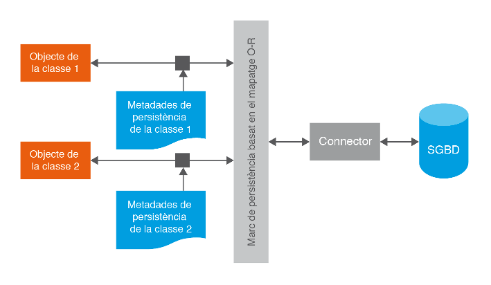

# 2 - Concepte de mapatge objecte-relacional

Les eines de mapatge objecte-relacional automatitzen els processos necessaris
d’intercanvi de dades entre Sistemes Orientats a Objectes (OO) i Sistemes
Relacionals.

Per tant ens ajuden a salvar el desfasament Objecte-Relacional de forma molt
còmoda.

L’automatització s’aconsegueix gràcies a un conjunt de metadades que descriuen
quin procés cal utilitzar i quina correspondència hi ha entre les dades
primitives d’ambdós sistemes i les estructures que les suporten.

La descripció més senzilla que han de fer les metadades és la d’establir una
correspondència directa entre classes i taules, i a nivell més bàsic entre els
atributs de tipus primitius i els camps o columnes. També caldrà identificar
l’atribut corresponent al camp que actuarà com a clau primària.

Lamentablement, no sempre es podrà establir aquest tipus de correspondències
directes i caldrà que les metadades puguen expressar molta més complexitat.
Aquestos són alguns dels problemes que ens podem trobar:

  * A vegades pot interessar guardar una propietat en més d’una columna o unes quantes propietats en una columna única.
  * Pot haver propietats que no es guarden i camps guardats que no es vegen reflectits als objectes.
  * Quan els atributs no siguen tipus de dades primitius caldrà saber també si haurem de guardar les dades en una taula diferent o en la mateixa taula i, en cas de que siga en taules diferents, quins atributs haurem de fer servir com a claus externes, qui tindrà la responsabilitat de realitzar l’emmagatzematge, etc. 

Llicenciat sota la  [Llicència Creative Commons Reconeixement NoComercial
CompartirIgual 2.5](http://creativecommons.org/licenses/by-nc-sa/2.5/)

