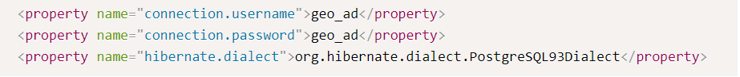
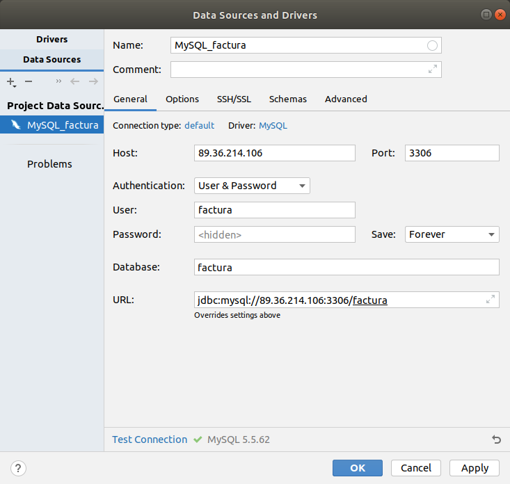
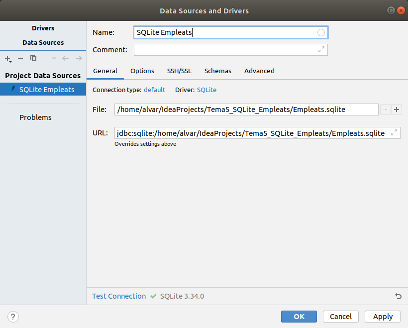
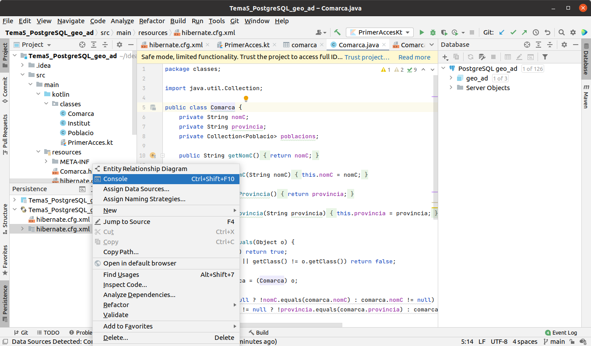
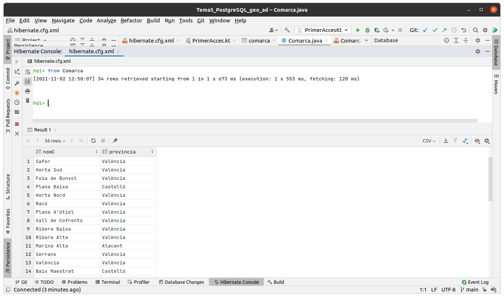
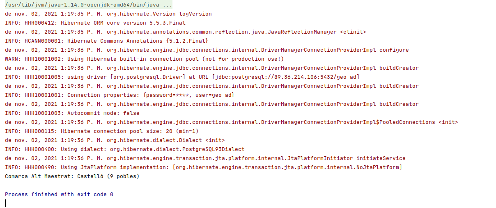

# 5 - Connexió a Hibernate

Des d'**IntelliJ Idea** no cal cap tipus d'instal·lació. Això sí, haurem
d'utilitzar la versió **ULTIMATE** per a poder fer projectes que connecten a
Hibernate.

Concretament seran projectes de tipus **Jakarta EE** , que és l'evolució de
**Java Enterprise** , i com dèiem només estan disponibles en la versió
**Ultimate**.

Durant aquest tema, cada connexió a una Base de Dades la farem en un projecte
diferent, al contrari que en temes anteriors, on ho vam col·locar tot en el
mateix projecte.

Aquestos projectes seran a més de tipus **Maven** , que es caracteritzen per
no haver d'incorporar les dependències (Drivers) a mà, sinó que es
reflecteixen automàticament en un fixter **pom.xml** , i ell s'encarrega de
baixar tots els drivers necessaris. Ho farem així perquè, a diferència del que
hem fet fins ara que hi havia pocs drivers a incorporar, per a **Hibernate**
seran molts .jar, per tant és molt més còmode un projecte Maven, que ell
s'encarregarà de baixartots els drivers necessaris

Els passos a seguir en cada projecte seran sempre els mateixos:

  * Crear un projecte de tipus **Jakarta EE**(en versions anterior, **Java Enterprise**), amb la implementació de **JPA** per **Hibernate**
  * Crear la connexió a la Base de Dades
  * Afegir la configuració de persistència d'Hibernate, per a generar el fitxer **hiernate.cfg.xml**
  * Mapejar les taules a classes
  * Incorporar el Driver del SGBD a utilitzar (PostgreSQL en l'exemple)
  * Acabar de configurar el fitxer **hibernate.cfg.xml**

El següent vídeo explica tot el procés de creació del projecte.

<iframe src="https://slides.com/aliciasalvador/ad-t5-connexiohibernate/embed" width="576" height="420" title="Copy of AD-T5-ConnexioHibernate" scrolling="no" frameborder="0" webkitallowfullscreen mozallowfullscreen allowfullscreen></iframe>

 
<b>Nota</b> 
En versions anteriors, en el fitxer <b>hibernate.cfg.xml</b> no es guardava
usuari ni contrasenya, i després li feia falta el dialecte de PostgreSQL.
Concretament s'havien d'afegir les següents línies:
   <pre><code>
        &ltproperty name="connection.username"&gtgeo_ad&lt/property&gt
        &ltproperty name="connection.password"&gtgeo_ad&lt/property&gt
        &ltproperty name="hibernate.dialect"&gtorg.hibernate.dialect.PostgreQL93Dialect&lt/property&gt
  </code></pre>
  

  
  <!---->
  

I observeu que en aquest exemple hem optat per incorporar el Driver
directament, ja que el teníem des del tema passat. Podríem haver optat també
per incorporar-lo a l'estil Maven, que seria senzillament incorporar en el
fitxer **pom.xml** en l'apartat de **<dependencies\>** la següent. Atenció: si
ja heu incorporat el Driver de PostgreSQL al projecte, no cal que fey el que
va a continuació

    
    
            <dependency>
                <groupId>org.postgresql</groupId>
                <artifactId>postgresql</artifactId>
                <version>42.2.24</version>
            </dependency>

I aquestes són les dades de connexió a la Base de Dades **geo_ad** de
**PostgreSQL** :

Si la connexió fóra a **MySQL** la BD **factura** , recordem que les dades de
connexió serien:

I fins i tot podem mapejar les taules d'una Base de Dades **SQLite** , amb una
connexió com aquesta:

## 5.1 - HQL: consultes senzilles

Podem provar consultes senzilles de HQL, que és el llenguatge propi de HQL,
paregut a SQL, però utilitzant objectes.

Ho podem fer obrint una consola d'Hibernate, des de la finestra de
Persistència, dins de la configuració d'**Hibernate** sobre
**hibernate.cfg.xml** , i amb el botó de la dreta triar **Console**

S'obrirà un apartat a la part de baix, i com que la connexió és sobre la que
havíem fet en la Base de Dades, si en la finestra **Database** estem
connectats, podrem fer les consultes **HQL**. La primera podria ser aquesta
**from Comarca**. Hem de respectar escrupulosament majúscules i minúscules, ja
que en definitiva estem accedint a les classes Java.

## 5.2 - Començant a programar

Com que hem fet un projecte Maven, totes les llibreries necessàries estaran ja
incorporades.

I si ja hem incorporat el Driver de PostgreSQL, bé directament tal com feem en
el Tema 4, bé incorporant la dependència en el fitxer pom.xml, aleshores ja
estem en condicions de començar a programar.

Tots els programes que farem, els posarem dins del paquet **exemples** , que
ha d'estar dins de **src - > main -> kotlin**. Aquest primer programa el podem
guardar amb el nom **Exemple_01_PrimerAcces.kt** :

    
    
    package exemples
    
    import org.hibernate.cfg.Configuration
    import classes.Comarca
    
    fun main(args: Array<String>) {
        val sf = Configuration().configure().buildSessionFactory()
        val sessio = sf.openSession()
        val com = sessio.get("classes.Comarca", "Alt Maestrat") as Comarca
        print("Comarca " + com.nomC + ": ")
        print(com.provincia)
        println(" (" + com.poblacions.size + " pobles)")
        sessio.close()
    }

L'execució ens haurà donat molts avisos, que són un poc pesats, però
l'execució (la línia en negre quasi al final) ha eixit bé

El programa a carregat la comarca de l'Alt Maestrat, i ens ha dit la província
i el número de pobles

Anem a llevar aquetsos missatge, que són únicament de INFO. Senzillament li
direm que mostre únicament els errors **severs**.

    
    
    LogManager.getLogManager().getLogger("").setLevel(Level.SEVERE)

Aprofitarem per a canviar un poc el programa, i ara traurem també el nom dels
pobles de la comarca Alt Maestrat. Així veiem també el potencial, ja que és
comodíssim accedir els pobles de la comarca. Guardeu el següent programa amb
el nom **Exemple_02_SegonAcces.kt** :

    
    
    package exemples
    
    import classes.Comarca
    import org.hibernate.cfg.Configuration
    import java.util.logging.Level
    import java.util.logging.LogManager
    
    fun main(args: Array<String>) {
        LogManager.getLogManager().getLogger("").setLevel(Level.SEVERE)
        val sessio = Configuration().configure().buildSessionFactory().openSession()
    
        val com = sessio.get("classes.Comarca", "Alt Maestrat") as Comarca
        print("Comarca " + com.nomC + ": ")
        print(com.provincia)
        println(" (" + com.poblacions.size + " pobles)")
    
        for (p in com.poblacions)
            println("\t" + p.nom)
        sessio.close()
    }

I aquest serà el resultat:

Llicenciat sota la  [Llicència Creative Commons Reconeixement NoComercial
CompartirIgual 2.5](http://creativecommons.org/licenses/by-nc-sa/2.5/)

