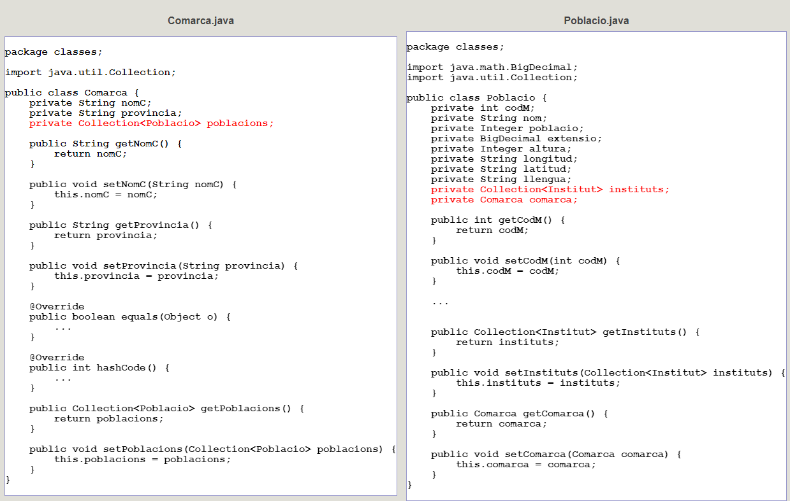

# 6 - Classes generades

Comentem les classe que ha generat automàticament Hibernate.

Són classes **Java**. Podríem traduir-les perfectament a Kotlin. Però optarem
per no canviar-les per fer el procés més senzill.

Posarà una propietat per cada camp de la taula, i alguna cosa més com veurem
més endavant. També posarà un mètode **get** i un **set** per a cada
propietat, ja que les propietats seran **private**.

A continuació mostrem 2 de les classes. En el cas de **Poblacio.java** no hem
posat tots els mètodes **get** i **set** , ja que sempre són com cabria
esperar. I en roig teniu el més destacable.
<!--
**Comarca.java** | **Poblacio.java**  
---|---  
-->

  
Sens dubte, el més destacable de la classe **Comarca** és que en les
propietats, posa també una **col·lecció d'objectes Poblacio**. Açò ens
permetrà accedir comodíssimament a les poblacions d'una determinada comarca.
Aquest conjunt sempre l'intenta anomenar com la classe a què fa referència,
però en plural (en el nostre cas seria **poblacios**) encara que en el moment
de dissenyar el mapatge podem canviar aquest nom. Una col·lacció
(**Collection**) té un comportament relativament senzill per a accedir als
seus elements.

En la classe **Poblacio** , tindrem les propietats que cabria esperar. I la
referència a la comarca és un objecte de la classe **Comarca**. També tindrà
un conjunt d'objectes **Institut**.

Per tant, i en resum, una cosa molt útil que fa Hibernate quan troba una clau
externa, és posar en la classe corresponent a la taula on està la clau externa
una propietat de la classe corresponent a la taula principal (cosa que en
principi cabria esperar); però també en la classe corresponent a la taula
principal, un conjunt d'objectes de la classe corresponent a l'altra taula, la
qual cosa ens permetrà accedir fàcilment.

Llicenciat sota la  [Llicència Creative Commons Reconeixement NoComercial
CompartirIgual 2.5](http://creativecommons.org/licenses/by-nc-sa/2.5/)

