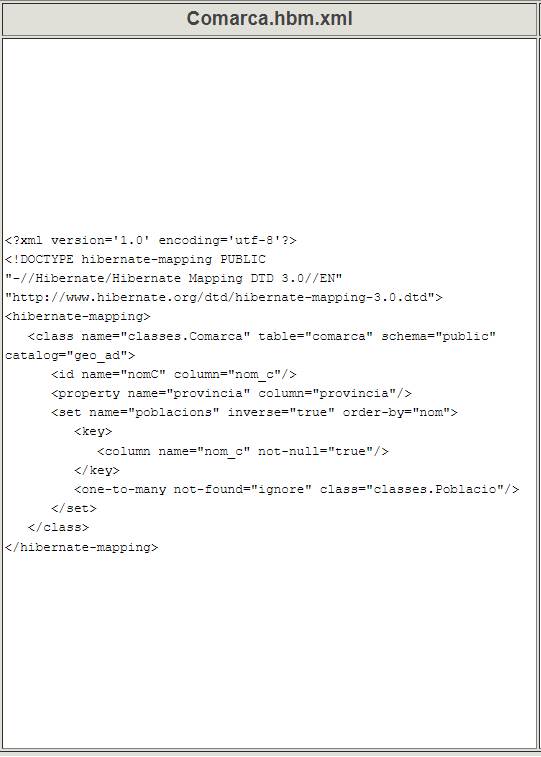
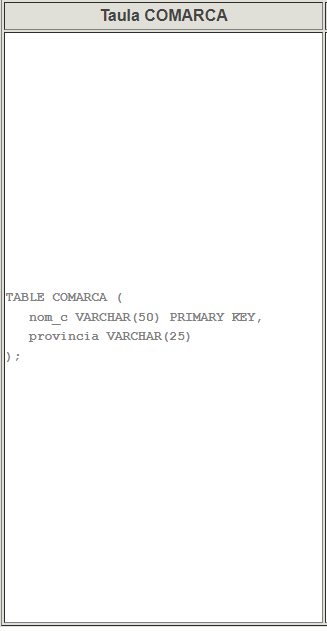
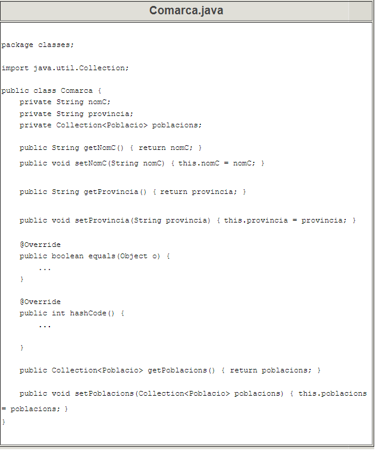

# 7 - Estructura dels fitxers de mapatge

En la pregunta 5.1 havíem vist les classes generades per Hibernate. Anem a
veure-ho ara amb més detall, mirant totes les classes i fitxers generades en
el procés de mapatge i com s'interrelacionen entre elles.

Els fitxers que serveixen de mapatge, Hibernate els genera de tipus **XML** ,
i seran:

  * **hibernate.cfg.xml** , ja comentat anteriorment i que estableix les condicions bàsiques de la connexió amb la Base de Dades (Driver, URL, usuari, contrasenya, ...).
  * Un fitxer **.hbm.xml** per cada taula (i classe). Així en el nostre exemple tindrem **Comarques.hbm.xml** , **Poblacions.hbm.xml** i **Instituts.hbm.xml** i són els encarregats de dir la correspondència entre els camps de la taula (p.e. COMARCA) i les propietats de l'objecte (p.e. Comarca.java).

La següent imatge explica aquesta manera d'enllaçar. Les nostre classes són
classes Kotlin, però totalment equivalents a les classes Java, per això es
deixa aquest nom en la imatge:


**<u>El fitxer hibernate.cfg.xml</u>**

El fitxer **hibernate.cfg.xml** estableix les condicions de la connexió.
Depenent de la versió, pot estar lleugerament diferent:
```
<?xml version='1.0' encoding='utf-8'?>  
<!DOCTYPE hibernate-configuration PUBLIC  
"-//Hibernate/Hibernate Configuration DTD//EN"  
"http://www.hibernate.org/dtd/hibernate-configuration-3.0.dtd">  
<hibernate-configuration>  
  <session-factory>  
    <property name="connection.url">jdbc:postgresql://89.36.214.106:5432/geo_ad</property>  
    <property name="connection.driver_class">org.postgresql.Driver</property>  
    <property name="connection.username">geo_ad</property>  
    <property name="connection.password">geo_ad</property>  
    <property name="hibernate.dialect">org.hibernate.dialect.PostgreSQL93Dialect</property>  
    <mapping resource="Comarca.hbm.xml"/>  
    <mapping resource="Institut.hbm.xml"/>  
    <mapping resource="Poblacio.hbm.xml"/>  
  </session-factory>  
</hibernate-configuration>
```
Podem observar com s'especifica el driver JDBC, la URL, l'usuari que es
connecta, la contrasenya i el dialecte (per a poder comunicar-se bé en
versions anteriors). També ha registrat els fitxers de mapatge.

**<u>Els fitxers .hbm.xml</u>**

Els fitxers **.hbm.xml** estableixen la correspondència entre taula i classe,
i dins d'elles entre camps de la taula i propietats de la classe. Mirem el
contingut de **Comarques.hbm.xml**. Posem a un costat l'estructura de la
taula, i a l'altre l'estructura de l'objecte:


|
---|---

                 


Comentem un poc les coses:

  * **< hibernate-mapping>** és l'element arrel; tot el mapatge està contingut dins d'ell.
  * **< class>** Equival a tota la classe per una banda i tota la taula per una altra. Dins d'aquest element estaran totes les correspondències de camps i propietats. 
    * L'atribut**name** conté el nom de la classe.
    * L'atribut **table** conté el nom de la taula corresponent.
    * Pot haver algun altre atribut, indicant el catàleg (depén del SGBD)
  * **< id>** especifica el camp que és clau principal. És diferent als camps normals. 
    * L'atribut **name** indica el nom de la propietat
    * L'atribut ******column** indica el camp de la taula
  * **< property>** especifica un camp normal, que no és clau principal. Només s'ha d'especificar:  

    * L'atribut **name** indica el nom de la propietat
    * L'atribut column indica el camp de la taula

I ens deixem per al final la manera d'enllaçar la clau externa. Recordem que
la clau externa està definida en **POBLACIO** i que apunta a **COMARCA**. En
el mapatge de **Comarca** tindrem una línia nova que és la que indica que la
propietat **poblacions** ha de contenir les poblacions de la comarca. És per
tant un conjunt (**Collection**) de moltes poblacions. Les coses més
importants són les següents:

  * **< set>** que indica que serà un conjunt 
    * L'atribut **name** serà el nom de la propietat
    * L'element **key** especifica la clau externa, amb l'element **column** i atribut **name** , en aquest cas **nom_c**.
    * L'element **one-to-many** indica que un departament pot tenir molts empleats (per això era un conjunt), i especifica de quina classe són amb l'atribut **class**

En el cas de les poblacions, taula **POBLACIO** i classe **Poblacio** , les
coses seran molt similars. La diferència més significativa és la manera de
representar la clau externa. Ara serà una relació **many-to-one** , indicant
que la població pot estar en una única comarca, és a dir farà referència a un
únic objecte **Comarca**.
```
<many-to-one name="comarca" class="classes.Comarca">  
<column name="nom_c" not-null="true"/>  
</many-to-one> 
``` 
---  
  
  * **< many-to-one****>** en la propietat que fa referència a l'altra classe   

    * L'atribut **name** indica el nom de la propietat.
    * L'atribut **class** indica la classe a què fa referència, en aquest cas **Comarca**.
    * L'element **column** és un element buit amb la propietat **name** , que contindrà el camp de la taula

En resum, dins de l'element **class** que equival a la classe (i la taula),
tindrem els elements**:**

  * **id** per a la clau principal
  * **property** per als camps normals
  * **set** per als que són apuntats per una clau externa, indicant el conjunt.
  * **many-to-one** per als que són clau externa****

## 7.1 - Anotacions en compte de fitxers xml de mpatge

Ja vam comentar en la pregunta 3 que hi havia 2 tècniques per a fer el
mapatge:

  * Per mig de fitxers **xml** , que són els que hem vist
  * Per mig d'**anotacions**

Les anotacions es fan en el mateix fitxer on està definida la classe que ens
ha resultat (Comarca.java, Poblacio.java i Institut.java), però per a que Java
no ho intente interpretar, en fan amb un símbol inicial i així distingir les
anotacions de les línies normals de la classe.

Aquest caràcter especial pel qual comencen les anotacions sol ser **@**

Aquest seria el resultat de la classe amb anotacions, si haguérem optat per
aquesta tècnica.

Es mostra només a nivell il·lustratiu. Vosaltres no ho tindreu en el vostre
projecte

    
    
    package classes;
    
    import javax.persistence.*;
    import java.util.Collection;
    
    @Entity
    public class Comarca {
        private String nomC;
        private String provincia;
        private Collection<Poblacio> poblacions;
    
        @Id
        @Column(name = "nom_c")
        public String getNomC() {
            return nomC;
        }
    
        public void setNomC(String nomC) {
            this.nomC = nomC;
        }
    
        @Basic
        @Column(name = "provincia")
        public String getProvincia() {
            return provincia;
        }
    
        public void setProvincia(String provincia) {
            this.provincia = provincia;
        }
    
        @Override
        public boolean equals(Object o) {
            ...
        }
    
        @Override
        public int hashCode() {
            ...
        }
    
        @OneToMany(mappedBy = "comarca")
        public Collection<Poblacio> getPoblacions() {
            return poblacions;
        }
    
        public void setPoblacions(Collection<Poblacio> poblacions) {
            this.poblacions = poblacions;
        }
    }
    

Observeu com tenim les mateixes coses que en els fitxers de mapatge, però
representat de forma lleugerament diferent


Llicenciat sota la  [Llicència Creative Commons Reconeixement NoComercial
CompartirIgual 2.5](http://creativecommons.org/licenses/by-nc-sa/2.5/)

