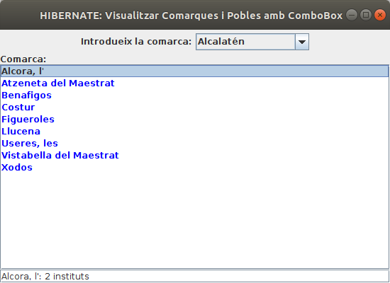
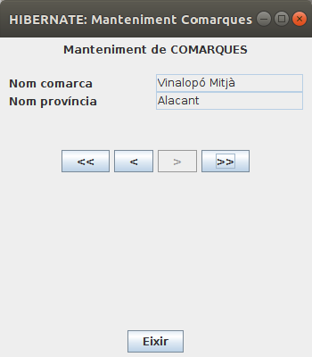
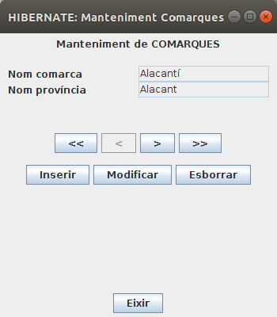
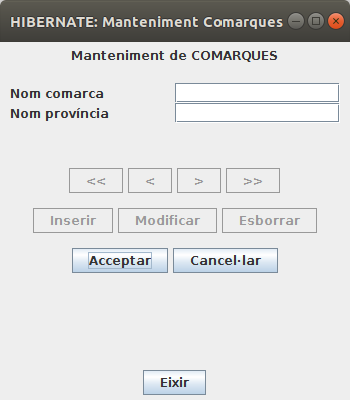
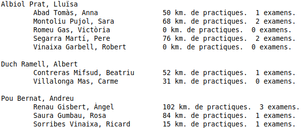

# Exercicis


##  Exercici 5.1

Crea un projecte nou de l'estil de **Java Enterprise** anomenat
**Tema5_****PostgreSQL_Rutes_Anotacions**. Inclou el driver JDBC de
PostgreSQL.

  * Has de fer el mapatge utilitzant **anotacions** (no els fitxer **hbm.xml**)
  * Fes el mapatge de les taules **RUTA** i **PUNT******, situades en la Base de Dades**rutes** a la qual pot accedir l'usuari **rutes**(contrasenya **rutes**) i situada en el servidor de l'Institut ****(**89.36.214.106**). Guarda-les en un paquet anomenat **classes**. Veuràs que en el resultat apareixerà també la classe **PuntPK.java**. És a causa de que la clau principal de la taula PUNTS està formada per dos camps. És la manera que té Hibernate de reflectir-ho.
  * Tria **tots** els camps (que es convertiran en propietats). Canvia el nom d'alguna de les propietats
  * Veuràs que en el resultat a més de les classes **Ruta.java** i **Punt.java** apareixerà també la classe **PuntPK.java**. És a causa de que la clau principal de la taula PUNTS està formada per dos camps. És la manera que té Hibernate de reflectir-ho.
  * Crea't el fitxer Kotlin **VeureRutes.kt** , que serà un programa senzill que visualitze les rutes, i el número de punts, ordenades per nom de ruta, a més dels noms dels punts.. Ha de ser per mig d'una **consulta HQL**(el més senzilla possible), i evidentment el programa ha de ser independent del número de rutes existent en aquest moment a la Base de Dades. Intenta que no apareguen tots els warnings que apareixen per defecte. El més normal és que t'aparega el següent error

>```Repeated column in mapping for entity: classes.Punt column: num_r (should be mapped with insert="false" update="false")```

Per a corregir-ho has d'afegir a la classe **Punt.java** al final de tot, on
apareix l'anotació **@JoinColumn** , el que està en negreta a continuació.

<div style="background-color: #F0F0F0; color: black; padding: 5px;">
@ManyToOne  
@JoinColumn(name = "num_r", referencedColumnName = "num_r", nullable = false, <b>insertable = false, updatable = false</b>) 
</div><p></p>
---  
  
  * Una vegada corregit l'error, el resultat seria aquest:
  
<div style="background-color: #F0F0F0; color: black; padding: 5px;">
<pre>
La Magdalena - 7 punts  
Primer Molí  
Segon Molí  
Caminàs  
Riu Sec  
Sant Roc  
Explanada  
La Magdalena

Pelegrins de Les Useres - 6 punts  
Les Useres  
Les Torrocelles  
Lloma Bernat  
Xodos (Molí)  
El Marinet  
Sant Joan

Pujada a Penyagolosa - 5 punts  
Sant Joan  
Encreuament  
Barranc de la Pegunta  
El Corralico  
Penyagolosa
</pre>
</div><p></p>


##  Exercici 5.2

Sobre el projecte de **Tema5_Hibernate_PostgreSQL_geo_ad** , on tenim el
mapatge de les taules **COMARCA** , **POBLACIO** i **INSTITUT** , creeu-vos un
paquet anomenat **exercicis** , on col·locareu les classes d'aquest exercici.

Per a visualitzar les coses d'una forma un poc més agradable anem a utilitzar
les llibreries gràfiques **Java AWT** i **Javax Swing**. Amb aquestes
llibreries incorporarem:

  * **JPanel** i **JScrollPane** , per a contenir altres objectes (aquest últim amb botons de scroll si són necessaris).
  * **JLabel** , per a etiquetes
  * **JText** , per a quadres de text (on poder posar informació)
  * **JTextArea** , és un quadre de text, però més gran. Nosaltres l'utilitzarem per a visualitzar informació extensa, i per tant el farem no editable.
  * **JButton** , per a botons. Estarà esperant a que l'apretem (ActionListener)

Tot açò anirà en un fitxer que anomenarem **Ex5_2_VeurePoblesComarca.kt**

I vosaltres haureu de completar el mètode **VisualitzaCom(comarca: String)** ,
per a que si no existeix la comarca, es diga que no existeix dins del
JTextArea, i si existeix, que es vegen **els seus pobles**(si vols pots
millorar-lo per a que es vegen en ordre alfabètic).

    
    
    package exercicis
    
    import java.awt.EventQueue
    import java.awt.BorderLayout
    import java.awt.FlowLayout
    import javax.swing.JFrame
    import javax.swing.JPanel
    import javax.swing.JButton
    import javax.swing.JTextArea
    import javax.swing.JLabel
    import javax.swing.JTextField
    import java.awt.Color
    import javax.swing.JScrollPane
    
    class Finestra : JFrame() {
    	val etiqueta = JLabel("Comarca:")
    	val etIni = JLabel("Introdueix la comarca:")
    	val com = JTextField(15)
    	val consultar = JButton("Consultar")
    	val area = JTextArea()
    
    	init {
    		defaultCloseOperation = JFrame.EXIT_ON_CLOSE
    		setTitle("HIBERNATE: Visualitzar Comarques i Pobles")
    		setBounds(100, 100, 450, 300)
    		setLayout(BorderLayout())
    
    		val panell1 = JPanel(FlowLayout ())
    		panell1.add(etIni)
    		panell1.add(com)
    		panell1.add(consultar)
    		getContentPane().add(panell1, BorderLayout.NORTH)
    
    		val panell2 = JPanel(BorderLayout ())
    		panell2.add(etiqueta, BorderLayout.NORTH)
    		area.setForeground(Color.blue)
    		val scroll = JScrollPane(area)
    		panell2.add(scroll, BorderLayout.CENTER)
    		getContentPane().add(panell2, BorderLayout.CENTER)
    
    		consultar.addActionListener() {
                etiqueta.setText("Comarca: " + com.getText())
                visualitzaCom(com.getText())
    		}
    	}
    	fun visualitzaCom(comarca: String){
            // Instruccions per a llegir la comarca que arriba com a paràmetre (s'ha de deixar en un objecte Comarca).
            // S'ha de cuidar que si no exiteix la comarca, en el JTextArea es pose que no existeix.
            // La manera d'anar introduint informació en el JTextArea és area.append("Linia que es vol introduir ")
    	}
    }
    
    fun main() {
    	EventQueue.invokeLater {
    		Finestra().isVisible = true
    	}
    }
    

Aquest seria un exemple d'utilització:


##  Exercici 5.3

Anem a fer unes quantes millores a l'exemple anterior. ****Les millores seran
les següents:

  * (70%) Substitueix el quadre de text per un **JComboBox** , i elimina el botó. Recorda que el component **JCombBox** funciona de la segünet manera: 
    * Per a obtenir l'element seleccionat utilitzarem el mètode******.getSelectedItem()**
    * Per a omplir el ComboBox haurem de fer una consulta prèvia amb els noms de les comarques (en principi amb els noms és suficient). Podrem anar afegint elements al ComboBox amb el mètode **.addItem()**
  * (15%) Substitueix el **JTextArea** on mostrem els pobles de la comarca per un **JList**. Aquest component serà una llista, i podrem seleccionar cada element de la llista. El seu funcionament és així: 
    * Per a anar omplint el **JList** , no és tant senzill com el **JComboBox**. Ens fa falta un **DefaultListModel** , i construir el **JList** a partir d'ell. Posteriorment afegirem elements al **DefaultListModel** , i això suposarà que es veuran en el **JList**. Ja tenim creat aquest DefaultListModel, i es diu **listModel**
    * Per a agafar els pobles de la comarca podem fer-ho de 2 maneres: 
      * carregant un objecte Comarca, i a partir d'ell obtenir els pobles
      * fent una consulta per agafar els pobles de la comrca. En aquest cas podem tenir el problema que hi haja cometes simples en el nom de la comarca (p.e. Vall d'Albaida). Açò faria que la consulta HQL falle (ja que la cometa simple és el delimitador de les constants de text). Una manera de solucionar-lo és utilitzar un paràmetre, ja que d'aquesta manera no hi haurà problema amb les cometes. Una altra manera de solucionar-lo és posar dos cometes simples. Podem utilitzar el mètode **replace()** de la classe String, substituint tota cometa simple per dues cometes simples. Si per exemple tenim el nom de la comarca en el String **comarca** , faríem: 
  
>>>>```comarca.replace("'","''")```

  * (15%) Quan se seleccione un element del **JList** , fes que es mostre baix de tot el número d'Instituts del poble seleccionat 
    * Per a poder controlar si s'ha seleccionat un element del **JList** escoltarem ambb **area.addListSelectionListener()**(si el **JList** s'anomena **area** , clar). És on posarem les accions per a mostrar el nombre d'Instituts del poble (**visualitzaInstituts(String)** )
    * El nom del poble també pot dur cometes simples, per tant farem la mateixa consideració d'abans. Ho solucionem amb un paràmetre, o posant dues cometes simple substituint el nom del poble per: 

>>>>```poble.replace("'","''")```

L'esquelet quedarà ara d'aquesta manera. Guardeu-lo en un fitxer anomenat
**Ex5_3_VeurePoblesComarca_Combobox.kt** :

    
    
    import java.awt.EventQueue
    import java.awt.BorderLayout
    import java.awt.FlowLayout
    import java.awt.Color
    import javax.swing.JFrame
    import javax.swing.JPanel
    import javax.swing.JLabel
    import javax.swing.JTextField
    import javax.swing.JScrollPane
    import javax.swing.JComboBox
    import javax.swing.DefaultListModel
    import javax.swing.JList
    import classes.Comarca
    import classes.Poblacio
    
    class FinestraComboBox : JFrame() {
    	val etiqueta = JLabel("Comarca:")
    	val etIni = JLabel("Introdueix la comarca:")
    	val com = JComboBox<String>()
    	val listModel = DefaultListModel<String>()
    	val area = JList(listModel)
    	val peu = JTextField()
    
        val sessio = Configuration().configure().buildSessionFactory().openSession()
    
    	init {
    		defaultCloseOperation = JFrame.EXIT_ON_CLOSE
    		setTitle("HIBERNATE: Visualitzar Comarques i Pobles amb ComboBox")
    		setBounds(100, 100, 550, 400)
    		setLayout(BorderLayout())
    
    		val panell1 = JPanel(FlowLayout())
    		panell1.add(etIni)
    		panell1.add(com)
    		getContentPane().add(panell1, BorderLayout.NORTH)
    
    		val panell2 = JPanel(BorderLayout())
    		panell2.add(etiqueta, BorderLayout.NORTH)
    		area.setForeground(Color.blue)
    		val scroll = JScrollPane(area)
    		panell2.add(scroll, BorderLayout.CENTER)
    		getContentPane().add(panell2, BorderLayout.CENTER)
    		getContentPane().add(peu, BorderLayout.SOUTH)
    
    		agafarComarques()
    
    		com.addActionListener() { visualitzaCom(com.getSelectedItem().toString()) }
    
    		area.addListSelectionListener() {
    			if (!area.isSelectionEmpty())
    				visualitzaInstituts(area.getSelectedValue())
    			else
    				peu.setText("")
    		 }
    	}
    
    	fun agafarComarques() {
    		// Instruccions per a posar en el ComboBox el nom de totes les comarques, millor si és per ordre alfabètic
    
    	}
    
    	fun visualitzaCom(comarca: String) {
    		// Instruccions per a llegir la comarca que arriba com a paràmetre (s'ha de deixar en un objecte Comarca).
    		// S'ha de cuidar que si no exiteix la comarca, en el JList es pose que no existeix.
    		// La manera d'anar introduint informació en el JList és a través del DefaultListModel:
    		// listModel.addElement("Linia que es vol introduir ")
    		// Per a esborrar els element del JList: listModel.clear()
    		// Es pot fer carregant un objecte, o per mig de consulta, però en aquest cas podem tenir problemes amb '
    		// Una manera de solucionar el problema de la cometa simple és utilitzar comarca.replaceAll("'","''").
    		// Una altra és utilitzar paràmetres
    
    	}
    
    	fun visualitzaInstituts(poble: String) {
    		// Instruccions per a mostrar el número d'Instituts del poble seleccionat
    		// La millor manera és per mig d'una consulta. Podem tenir problemes amb la cometa simple
    		// Una manera de solucionar el problema de la cometa simple és utilitzar poble.replaceAll("'","''").
    		// Una altra és utilitzar paràmetres
    
    	}
    
    }
    
    fun main() {
    	EventQueue.invokeLater {
    		FinestraComboBox().isVisible = true
    	}
    }
    

Aquest seria un exemple d'execució:




##  Exercici 5.4

Anem a intentar un programa per al manteniment de les comarques (no intentarem
mantenir els pobles de la comarca, únicament el nom i la província de la
comarca). Ha d'estar en el paquet **Exercicis** del projecte
**Tema5_Hibernate_PostgreSQL_geo_ad.**

En una primera fase únicament posarem 2 quadres de text per al nom i la
província (amb 2 etiquetes) i 4 botons per a desplaçar-nos: al primer, a
l'anterior, al següent i a l'últim.



Heu de modificar els mètodes on estan les indicacions:

  * El mètode **agafarComarques()** ha de tornar la llista de les comarques. Per tant heu de fer una consulta HQL el més senzilla possible i posar tots els objectes de les comarques en la llista.
  * El mètode **visComarca(int)** servirà per a visualitzar la comarca l'índex de la qual es passa per paràmetre, assignant els valors als **JtextField nomComarca** i **nomProvincia**
  * Implementa els 4 botons de desplaçament.
  * Controla que no es puga eixir fora del rang deshabilitant els botons corresponents quan s'estiga en la primera o l'última comarca. No t'oblides d'habilitar-los quan toque.

Ací tens "l'esquelet" del programa. Observa que la sessió està creada en la
zona de declaracions de les propietats. Podríem haver-la creat en el mètode
**afafarComarques()** , que és quan per mig d'una sentència **HQL** agafarem
totes les comarques i les posarem en un **ArrayList <Comarca>**.

D'aquesta manera podríem tancar la sessió en el mateix
mètode**agafarComarques()** i no utilitzar més recursos dels necessaris. Hem
optat per tenir la sessió oberta durant tota la durada del programa per fer-lo
igual que en el següent exercici, en el qual sí que ens convé tenir la sessió
oberta mentre dure el programa. Amb aquesta intenció, el programa té
deshabilitada l'opció de tancar la finestra (_**defaultCloseOperation =
JFrame.DO_NOTHING_ON_CLOSE**_), i obligatòriament s'ha de tancarapretant al
boto **Eixir**. Aprofitarem el mètode associat al botó per a tancar la sessió
(**s**)

Observeu també que a banda de **llistaComarques** , l'arraylist on estan tots
els objectes comarques, també tenim la propietat **indActual** , on guardem
l'índex actual, és a dir, l'índex de la comarca que s'ha d'estar visualitzant
en aquest moment.

Guarda-t'ho en el fitxer Kotlin **Ex5_4_MantenimentComarques.kt**

    
    
    import java.awt.BorderLayout
    import java.awt.FlowLayout
    import java.awt.GridLayout
    import java.awt.event.ActionEvent
    import java.awt.event.ActionListener
    import java.awt.EventQueue
    
    import javax.swing.JButton
    import javax.swing.JFrame
    import javax.swing.JLabel
    import javax.swing.JPanel
    import javax.swing.JTextField
    
    import org.hibernate.Query
    import org.hibernate.Session
    
    import classes.Comarca
    import java.awt.event.WindowEvent
    
    import kotlin.system.exitProcess
    
    class FinestraMantenimentComarques : JFrame() {
    	val etIni = JLabel("Manteniment de COMARQUES")
    	val etNom = JLabel("Nom comarca")
    	val etProv = JLabel("Nom província")
    
    	val nomComarca = JTextField()
    	val nomProvincia = JTextField()
    
    	val primer = JButton("<<")
    	val anterior = JButton("<")
    	val seguent = JButton(">")
    	val ultim = JButton(">>")
    
    	val eixir = JButton("Eixir")
    
    	val pDalt = JPanel(FlowLayout())
    	val pCentre = JPanel(GridLayout(8, 0))
    	val pDades = JPanel(GridLayout(2, 2))
    	val pBotonsMov = JPanel(FlowLayout())
    	val pEixir = JPanel(FlowLayout())
    
        val sessio = Configuration().configure().buildSessionFactory().openSession()
    
    	var llistaComarques = ArrayList<Comarca>()
    	var indActual = 0;
    
    	init {
    		defaultCloseOperation = JFrame.DO_NOTHING_ON_CLOSE
    		setTitle("HIBERNATE: Manteniment Comarques")
    
    		setBounds(100, 100, 350, 400)
    		setLayout(BorderLayout())
    
    		getContentPane().add(pCentre, BorderLayout.CENTER)
    		getContentPane().add(JPanel(FlowLayout()), BorderLayout.WEST)
    		getContentPane().add(JPanel(FlowLayout()), BorderLayout.EAST)
    		getContentPane().add(pEixir, BorderLayout.SOUTH)
    
    		pDalt.add(etIni)
    		pCentre.add(pDalt)
    
    		pDades.add(etNom)
    		pDades.add(nomComarca)
    		pDades.add(etProv)
    		pDades.add(nomProvincia)
    		pCentre.add(pDades)
    
    		nomComarca.setEditable(false)
    		nomProvincia.setEditable(false)
    
    		pCentre.add(JPanel(FlowLayout()))
    
    		pBotonsMov.add(primer)
    		pBotonsMov.add(anterior)
    		pBotonsMov.add(seguent)
    		pBotonsMov.add(ultim)
    		pCentre.add(pBotonsMov)
    		
    		pEixir.add(eixir)
    
    		llistaComarques = agafarComarques()
    		visComarca()
    
    		primer.addActionListener() { primer() }
    		anterior.addActionListener() { anterior() }
    		seguent.addActionListener() { seguent() }
    		ultim.addActionListener() { ultim() }
    		
    		eixir.addActionListener() { eixir()}
    	}
    
    	fun agafarComarques(): ArrayList<Comarca> {
    		var llista = ArrayList<Comarca>()
    		// ací aniran les sentències per a omplir (i retornar) la llista de comarques
    
    		return llista
    	}
    
    	fun visComarca() {
    		// Mètode per a visualitzar la comarca marcada per l'índex que ve com a paràmetre
    
    		controlBotons()
    	}
    
    	fun primer() {
    
    		visComarca()
    	}
    
    	fun anterior() {
    
    		visComarca()
    	}
    
    	fun seguent() {
    
    		visComarca()
    	}
    
    	fun ultim() {
    
    		visComarca()
    	}
    
    	fun controlBotons() {
    		// Mètode per a habilitar/deshabilitar els botons anterior i següent, si s'està en la primera o última comarca
    		// No us oblideu d'habilitar-los quan toque
    
    	}
    
    	fun eixir() {
    		//accions per a tancar i per a eixir
    
    		exitProcess(0)
    	}
    }
    
    fun main() {
    	EventQueue.invokeLater {
    		FinestraMantenimentComarques().isVisible = true
    	}
    }
<!--


## Exercici 5.5 (voluntari)

Modifica l'anterior ****per a posar també botons per a Inserir noves
comarques, esborrar o modificar. En un primer moment aquestos botons
prepararan l'acció, però no la realitzaran.



  * Quan s'aprete qualsevol dels 3, **Inserir** , **Modificar** o **Esborrar** , es visualitzaran uns altres dos (ja creats, ara es visualitzaran) que seran els d'**Acceptar** i **Cancel·lar**. A més d'aixó: 
    * el d'inserir ha de netejar els quadres de text i posar-los com a editables.
    * el de modificar ha de permetre l'edició de la província, i únicament la província. No intentarem modificar el nom de la comarca perquè és la clau principal de la taula associada.
  * En apretar Cancel·lar, s'ha de tornar a l'estat anterior, fer els TextField no editables i fer invisibles els botons d'Acceptar i Cancel·lar.
  * En apretar Acceptar, s'ha de distingir quina acció s'està fent, inserir, esborrar o modificar, i realitzar tal acció en la Base de Dades. Posteriorment s'hauran de fer invisibles els botons d'Acceptar i Cancel·lar, i en tot cas fer els TextField com a no editables
  * Seria molt útil que en quan s'està fent una actualització (Inserir, Modificar o Esborrar), es desactiven tant els botons de moviment com d'actualització. En apretar Acceptar o Cancel·lar a més de fer les accions citades abans, s'haurien de tornar a activar els botons de moviment i d'actualització.



Ací està "l'esquelet" del programa, que podeu guardar amb el nom
**Ex5_5_MantenimentComarquesAvancat.kt**

    
    
    import java.awt.BorderLayout
    import java.awt.FlowLayout
    import java.awt.GridLayout
    import java.awt.event.ActionEvent
    import java.awt.event.ActionListener
    import java.awt.EventQueue
    
    import javax.swing.JButton
    import javax.swing.JFrame
    import javax.swing.JLabel
    import javax.swing.JPanel
    import javax.swing.JTextField
    
    import org.hibernate.Query
    import org.hibernate.Session
    
    import classes.Comarca
    import java.awt.event.WindowEvent
    
    import kotlin.system.exitProcess
    
    class FinestraMantenimentComarquesAvancat : JFrame() {
    	val etIni = JLabel("Manteniment de COMARQUES")
    	val etNom = JLabel("Nom comarca")
    	val etProv = JLabel("Nom província")
    
    	val nomComarca = JTextField()
    	val nomProvincia = JTextField()
    
    	val primer = JButton("<<")
    	val anterior = JButton("<")
    	val seguent = JButton(">")
    	val ultim = JButton(">>")
    
    	val inserir = JButton("Inserir")
    	val modificar = JButton("Modificar")
    	val esborrar = JButton("Esborrar")
    
    	val acceptar = JButton("Acceptar")
    	val cancelar = JButton("Cancel·lar")
    
    	val eixir = JButton("Eixir")
    
    	val pDalt = JPanel(FlowLayout())
    	val pCentre = JPanel(GridLayout(8, 0))
    	val pDades = JPanel(GridLayout(2, 2))
    	val pBotonsMov = JPanel(FlowLayout())
    	val pBotonsAct = JPanel(FlowLayout())
    	val pBotonsAccCanc = JPanel(FlowLayout())
    	val pEixir = JPanel(FlowLayout())
    
        val sessio = Configuration().configure().buildSessionFactory().openSession()
    
    	var llistaComarques = ArrayList<Comarca>()
    	var indActual = 0
    
    	var accio: String = ""
    
    	init {
    		defaultCloseOperation = JFrame.DO_NOTHING_ON_CLOSE
    		setTitle("HIBERNATE: Manteniment Comarques")
    
    		setBounds(100, 100, 350, 400)
    		setLayout(BorderLayout())
    
    		getContentPane().add(pCentre, BorderLayout.CENTER)
    		getContentPane().add(JPanel(FlowLayout()), BorderLayout.WEST)
    		getContentPane().add(JPanel(FlowLayout()), BorderLayout.EAST)
    		getContentPane().add(pEixir, BorderLayout.SOUTH)
    
    		pDalt.add(etIni)
    		pCentre.add(pDalt)
    
    		pDades.add(etNom)
    		pDades.add(nomComarca)
    		pDades.add(etProv)
    		pDades.add(nomProvincia)
    		pCentre.add(pDades)
    
    		nomComarca.setEditable(false)
    		nomProvincia.setEditable(false)
    
    		pCentre.add(JPanel(FlowLayout()))
    
    		pBotonsMov.add(primer)
    		pBotonsMov.add(anterior)
    		pBotonsMov.add(seguent)
    		pBotonsMov.add(ultim)
    		pCentre.add(pBotonsMov)
    
    		pBotonsAct.add(inserir)
    		pBotonsAct.add(modificar)
    		pBotonsAct.add(esborrar)
    		pCentre.add(pBotonsAct)
    
    		pBotonsAccCanc.add(acceptar)
    		pBotonsAccCanc.add(cancelar)
    		pCentre.add(pBotonsAccCanc)
    		pBotonsAccCanc.setVisible(false)
    
    		pEixir.add(eixir)
    
    		llistaComarques = agafarComarques()
    		visComarca()
    
    		primer.addActionListener() { primer() }
    		anterior.addActionListener() { anterior() }
    		seguent.addActionListener() { seguent() }
    		ultim.addActionListener() { ultim() }
    
    		inserir.addActionListener() { inserir() }
    		modificar.addActionListener() { modificar() }
    		esborrar.addActionListener() { esborrar() }
    
    		acceptar.addActionListener() { acceptar() }
    		cancelar.addActionListener() { cancelar() }
    
    		eixir.addActionListener() { eixir() }
    	}
    
    	fun agafarComarques(): ArrayList<Comarca> {
    		var llista = ArrayList<Comarca>()
    		// ací aniran les sentències per a omplir (i retornar) la llista de comarques
    
    		return llista
    	}
    
    	fun visComarca() {
    		// Mètode per a visualitzar la comarca marcada per l'índex que ve com a paràmetre
    
    		controlBotons()
    	}
    
    	fun primer() {
    
    		visComarca()
    	}
    
    	fun anterior() {
    
    		visComarca()
    	}
    
    	fun seguent() {
    
    		visComarca()
    	}
    
    	fun ultim() {
    
    		visComarca()
    	}
    
    	fun controlBotons() {
    		// Mètode per a habilitar/deshabilitar els botons anterior i següent, si s'està en la primera o última comarca
    		// No us oblideu d'habilitar-los quan toque
    
    	}
    
    	fun inserir() {
    		//accions per a preparar per a inserir una nova comarca
    
    	}
    
    	fun modificar() {
    		//accions per a preparar per a modificar la comarca actual
    
    	}
    
    	fun esborrar() {
    		//accions per a preparar per a esborrar la comarca actual
    
    
    	}
    
    	fun acceptar() {
    		//accions per a fer l'acció d'inserir, modificar i esborrar
    
    	}
    
    	fun cancelar() {
    		//accions per a cancel·lar la inserció, modificació o esborrat
    
    	}
    
    	fun buscaCom(text: String): Int {
    		// Busca la comarca passada com a paràmetre en llistaComarques, tornant el seu índex. Per a situar-se després d'una inserció.
    		var ind = 0
    		// Ací haurien d'anar les sentències
    
    		return ind
    	}
    
    	fun activarBotons(b: Boolean) {
    		// Mètode per activar o desactivar (segons el paràmetre) els botons de moviment i els d'actualització
    		// Farem invisible o visible el panell dels botons acceptar i cancel·lar (pBotonsAccCanc
    
    	}
    
    	fun eixir() {
    		//accions per a tancar i per a eixir
    
    	}
    }


## Exercici 5.6 (voluntari)

Crea un projecte nou anomenat **Tema5_****PostgreSQL_Autoescola_Anotacions**.
Inclou el driver JDBC de PostgreSQL.

  * Per mig **d'ANOTACIONS** (no els fitxers de mapatge hbm.xml) fes el mapatge de totes les taules********, situades en la Base de Dades**autoescola** a la qual pot accedir l'usuari **autoescola**(contrasenya **autoescola**) i situada en el servidor de l'Institut ****(**89.36.214.106**). Guarda-les en un paquet anomenat **classes**. El mapatge serà de 5 taules: **ALUMNE, EXAMEN, PRACTIQUES, PROFESSOR i VEHICLE**.
  * El resultat seran les classes: **Alumne.java** , **Examen.java** , **Practiques.java** , **Professor.java** , **Vehicle.java** i també **ExamenPK.java** i **PractiquesPK.java** , ja que la clau principal de EXAMEN i de PRACTIQUES està formada per dos camps.
  * En el moment del mapatge has d'anar amb compte amb el tipus de les propietats. No convé que deixes en cap moment el tipus **Object**. Intenta buscar el tipus adequat en cada cas.
  * Posteriorment, per a que funcionen els programes has de modificar les classes **Examen** i **Practiques** , afegeix el que està en negreta a l'anotació del JoinColumn que es refereix al dni de l'alumne

@ManyToOne  
@JoinColumn(name = "dni", referencedColumnName = "dni", nullable = false,
**insertable = false, updatable = false**)  
---  
  
  * En el mateix paquet **classes** , crea't el fitxer **ConsultaAutoescola.kt** , que serà un programa senzill que visualitzarà els professors de l'autoescola i els seus alumnes, ordenats pel nom del professor. Completarem la informació amb els quilòmetres realitzats pels alumnes en la totalitat de les seues pràctiques i el número d'exàmens que ha realitzat. Intenta llevar els warnings que sempre ens dóna Hibernate. El resultat seria aquest:



-->

Llicenciat sota la  [Llicència Creative Commons Reconeixement NoComercial
CompartirIgual 2.5](http://creativecommons.org/licenses/by-nc-sa/2.5/)

